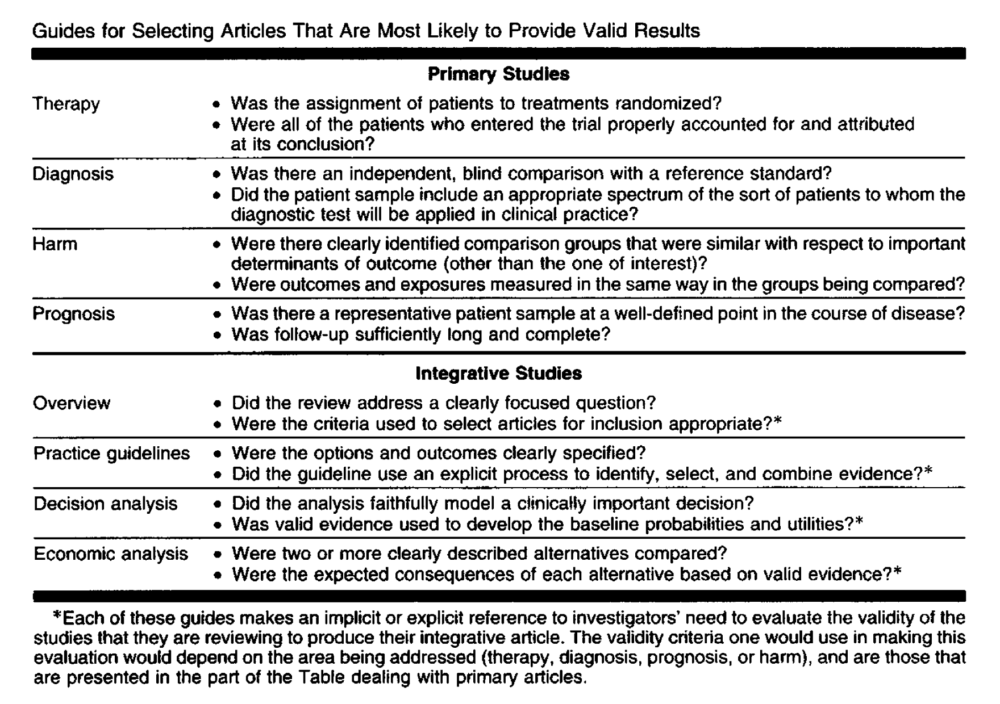

There's a series from JAMA that goes over how to read clinical trials. The series is written by individuals who are widely recognized in the field of evidence-based medicine. The entire series is a valuable resource for navigating literature in general, but there's a total of six relevant parts to the series, specifically on how to read clinical trials:

I: [how to get started](https://jamanetwork.com/journals/jama/article-abstract/409068)\
II-A: [validity of therapy/prevention studies](https://jamanetwork.com/journals/jama/article-abstract/409494)\
II-B: [results and whether they help your patients](https://jamanetwork.com/journals/jama/fullarticle/361625)\
XIV: [applicability of clinical trial results to your patient](https://jamanetwork.com/journals/jama/fullarticle/187253)\
XIX-A: [surrogate endpoints](https://jamanetwork.com/journals/jama/fullarticle/191311)\
XIX-B: [drug class effect](https://jamanetwork.com/journals/jama/fullarticle/191982)\

I'm skipping some parts because they're rather long and other parts aren't as relevant to clinical trials. 

{fig-cap="Guide to reading clinical trials from JAMA"}

