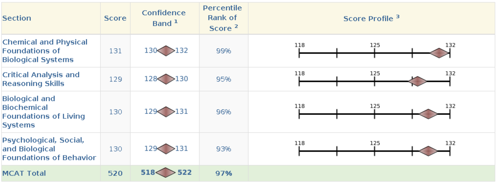

It's a useless exam. There are a million other ways that I would've liked to spend my time, but nevertheless, it's a necessary part of the process. I don't have much to say about it; I just wanted to write a little bit about my experience, given that I finished taking the exam.

Overall, it's a tedious exam; there's nothing particularly difficult about it. That is, the questions do not require much thinking, often relying on memorization alone, which, I must say, is not a great metric for intelligence. The exam is around seven hours long, but it goes by much quicker when you're actually taking it.

The minimum score is 472, and the maximum is 528. The average score is around 500, so you can see that the distribution is pretty tight. It's not a great scale for distinguishing between candidates, so, as you can tell, the exam is useless. It's merely a box to check off.

In the subsequent sections, I'll give brief comments on the resources I used to prepare for the exam. Note that 99% of what I studied was not necessary for the exam; just go over the general concepts and move on.

### Textbooks

No need to read closely; just skim. Understand the general concepts, but don't worry about memorizing details. I used Kaplan's books, but I don't think it matters which ones you use. For the P/S section, I used the Khan Academy 300-page doc, but I'm aware of the shorter version. The latter should suffice. Don't bother with the Khan Academy videos; they take too much time. As you read, unsuspend the corresponding Anki cards via tags.

### Anki

Try to do it every day; I didn't. I ultimately was able to finish all the cards, but I had to do a lot of cramming at the end. I used MileDown's Anki deck. Try to spend as little time as you can on the cards; average around 5 seconds per card max, ideally less.

### UWorld

I used the question bank, but most of it isn't necessary; I'd say do half of the problem sets and shift things around depending on your weakest subjects. Don't even bother with CARS (unless you're illiterate). The questions are pretty tough (only for chem and bio), unlike the actual exam, and test mostly trivial details, relying almost entirely on memorization. The process is dreary, but it helps you get used to the format of the questions. Expect to consistently score around 70% on practice exams from the question bank. The highest I've ever scored was 90%.

### AAMC Practice Exams

I did one or two practice exams; I can't seem to remember which ones were free and which were paid. I only did the free ones. Leave this for later in your studying.

After 3 months of actual studying, I finished the material and was able to get enough practice from the question bank. I ended up scoring a 520, but again, it says nothing about my intelligence or potential as a physician. I just happened to be good at memorizing things, which is what the exam tests. It's not worth the time and effort, but it is what it is. I'm glad it's over.

Screw the exam, and I'm never looking at any of the material ever again.

{fig-cap="MCAT Score Breakdown"}