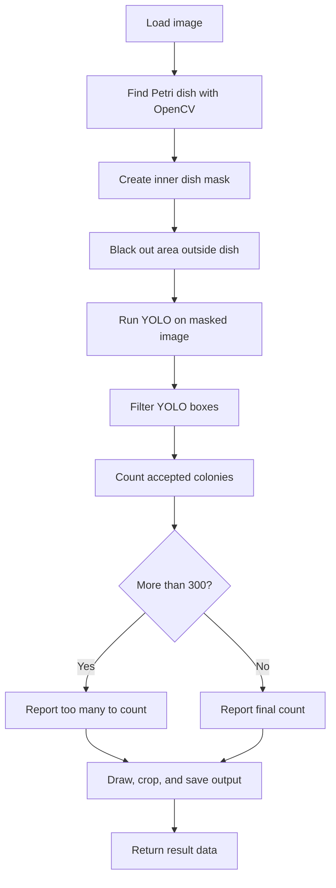

Model used is YOLOv8n pretrained on colonies [@wangColonyYOLOLightweightMicroColony2025], but optimized for our use. The process is as follows:

Flowchart outlines the steps involved in the colony counting process using YOLOv8n. Below are some sample images obtained from using the model to count colonies on our plates/public datasets. Does a pretty good job overall. We can further optimize the model (though this requires labelling of our data) and the filtering process to improve accuracy, but this is a solid starting point for our colony counting needs.

::: {layout-ncol=2}

{fig-cap="Plate 735"}

{fig-cap="Plate 14618"}

{fig-cap="SP19 image 15"}

10%5E-2_colonies_counted.png){fig-cap="WT 10^-2"}

:::

It has trouble with the smallest colonies, which is expected since these cases were not included in the public training data. Again, we can improve this by labelling some of our own data and fine-tuning the model.

{fig-cap="Flame Atomization Zones"}

# YOLOv8n Training

I chose the model because it is the smallest and fastest YOLOv8 model, which is ideal for our application where we need to process a large number of images efficiently. It also isn't too old of a model. At the end of training, `best.pt` ended with:

Precision:  0.866\
Recall:     0.788\
mAP50:      0.845\
mAP50-95:   0.484\
Planned: 50 epochs\
Actually completed: 46 epochs\
Best model: epoch 36\

# Detecting the plate
Hough Circle Transform is used to find the circular shape of the Petri dish in the image. This allows us to create a mask that isolates the area of interest (the inside of the dish) and eliminates any background noise that could interfere with colony detection. From what I understand the method converts the image to grayscale, applies a Gaussian blur to reduce noise, and draws circles of differing radii based on the detected edges. The point at which most circles overlap is likely the center of the dish, and the radius can be determined from the distance to the edge of the dish.