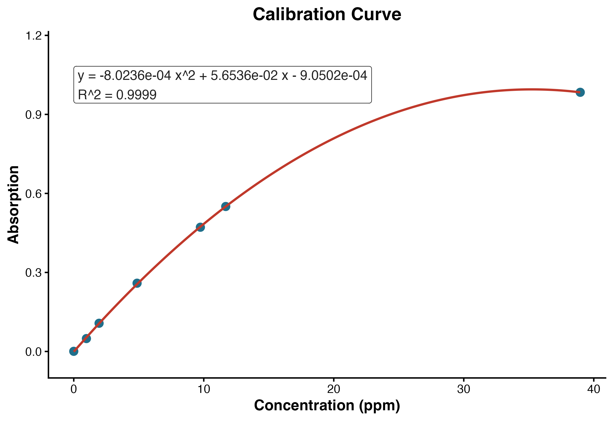

*Quantification of Iron in E. coli Cells by Atomic Absorption Spectroscopy*

## Purpose

This protocol describes the use of atomic absorption spectroscopy (AAS) to quantify iron in an *E. coli* cell sample using an external calibration curve.

## General Procedure

### Day 1: Setup

1. Prepare and sterilize TB medium, defined here as 1% tryptone and 0.5% NaCl by mass. For 100 mL, use 1.0 g tryptone and 0.50 g NaCl.
2. Prepare three 1 L media portions. For each liter, use 10 g tryptone and 5 g NaCl.
3. Start three small seed cultures from a single colony by inoculating 5 mL of TB medium for each culture.
4. Incubate the seed cultures at 37 degrees C.

### Day 2: Inoculation

1. Use each of the three 5 mL seed cultures to inoculate one 1 L portion of medium.
2. Incubate at 37 degrees C with shaking at approximately 150 rpm until the culture reaches an optical density near 0.8. This typically takes 6-8 hours.

### Day 3: Main Culture Growth, Harvest, and Storage

1. Grow the main culture to OD600 0.6-0.8.
2. Harvest the biomass by centrifugation. For each liter of culture, partition the culture among four 250 mL centrifuge bottles.
3. Centrifuge at 6000 x g for 10 minutes.
4. Aspirate the supernatant.
5. Repeat the partitioning, centrifugation, and aspiration steps until all 3 L of culture has been pelleted.
6. Combine the cells from the centrifuge bottles into a single centrifuge bottle using a spatula.
7. Rinse the cells with PBS, ideally iron-free PBS, to remove extracellular iron.
8. Repeat the PBS rinse three times, centrifuging between rinses to pellet the cells.
9. Weigh an empty 125 mL flask and record the blank flask mass.
10. Discard the PBS rinse supernatant from the centrifuged cells.
11. Transfer the cell pellet into the weighed 125 mL flask using a spatula.
12. Reweigh the flask containing the cells and calculate the cell mass by difference.
13. Freeze the cells if AAS analysis will be delayed. If AAS analysis will occur within a few days, store the cells in a refrigerator.

### Day 4: Digestion of Cells

1. Add 30 mL of nitric acid to the cell sample.
2. Boil the solution until it becomes clear and no visible organic matter remains. Do not allow the organic matter to caramelize.
3. Remove the solution from heat.
4. Once the solution is cool to the touch, add 10 mL of hydrogen peroxide.
5. Boil again until no organic matter remains. The final digest should be relatively clear and yellow. Boil down to the smallest amount reasonable without encouraging burning of the sample.
6. Retain the digested sample for AAS analysis.

### Day 5: AAS Analysis

1. Prepare the blank, iron calibration standards, and unknown sample solutions using the same matrix whenever possible.
2. Warm up and configure the AAS for iron analysis according to the instrument method.
3. Blank the instrument with the reagent blank.
4. Measure each calibration standard and record the absorbance.
5. Fit the calibration data using a second-order polynomial model:

$$
y = ax^2 + bx + c
$$

where $x$ is iron concentration in ppm and $y$ is absorbance.

6. Measure the unknown sample at least twice. Average the absorbance values.
7. Solve the polynomial calibration equation for the unknown concentration.
8. Convert the concentration to total iron mass and normalize to the mass of cells used to prepare the unknown.

## Calibration Data and Curve

The calibration standards used for this example are shown below. A second-order polynomial trendline was fit in R using the model $y \sim x + x^2$.

| Concentration, x (ppm) | Absorbance, y |
| ---------------------: | ------------: |
|                  0.000 |        0.0006 |
|                  0.974 |        0.0490 |
|                  1.948 |        0.1071 |
|                  4.870 |        0.2592 |
|                  9.740 |        0.4717 |
|                 11.690 |        0.5504 |
|                 38.960 |        0.9839 |

\

The fitted calibration equation was:

$$
y = -8.0236 \times 10^{-4}x^2 + 5.6536 \times 10^{-2}x - 9.0502 \times 10^{-4}
$$

$$
R^2 = 0.9999
$$

## Unknown Sample Calculation

The unknown sample was measured twice:

$$
A_1 = 0.3515, \qquad A_2 = 0.3517
$$

The average absorbance was:

$$
\bar{A} = \frac{0.3515 + 0.3517}{2} = 0.3516
$$

Substituting $y = 0.3516$ into the calibration equation:

$$
0.3516 = -8.0236 \times 10^{-4}x^2 + 5.6536 \times 10^{-2}x - 9.0502 \times 10^{-4}
$$

Rearranging:

$$
-8.0236 \times 10^{-4}x^2 + 5.6536 \times 10^{-2}x - 3.5250502 \times 10^{-1} = 0
$$

Solving the quadratic gives two mathematical roots. The root within the calibration range is:

$$
x = 6.913389~\mathrm{ppm}
$$

Since ppm is treated as mg/L:

$$
6.913389~\mathrm{mg/L} \times 0.0500~\mathrm{L}
= 0.345669~\mathrm{mg~Fe}
$$

Convert milligrams of iron to grams:

$$
0.345669~\mathrm{mg~Fe} \times
\frac{1~\mathrm{g}}{1000~\mathrm{mg}}
= 3.45669 \times 10^{-4}~\mathrm{g~Fe}
$$

Normalize to the cell mass used to prepare the sample:

$$
\frac{3.45669 \times 10^{-4}~\mathrm{g~Fe}}{9.20~\mathrm{g~cells}}
= 3.75728 \times 10^{-5}~\mathrm{g~Fe/g~cells}
$$

Rounded to three significant figures:

$$
\boxed{3.76 \times 10^{-5}~\mathrm{g~Fe/g~cells}}
$$

## Expected Range Check

Andrews et al. report that the iron content of *E. coli* ranges from approximately $10^5$ to $10^6$ iron atoms per cell, depending on growth conditions [@andrewsBacterialIronHomeostasis2003a]. Phillips, Kondev, and Theriot list a common rule-of-thumb mass for one *E. coli* cell as 1 pg, or $1.0 \times 10^{-12}$ g [@phillipsPhysicalBiologyCell2012]. These literature-supported values are used as inputs for the expected-range calculation below.

Using Avogadro's constant:

$$
N_A = 6.02214076 \times 10^{23}~\mathrm{atoms~mol^{-1}}
$$

and the molar mass of iron:

$$
M_{\mathrm{Fe}} = 55.845~\mathrm{g/mol}
$$

For $10^5$ iron atoms per cell:

$$
10^5~\mathrm{atoms~Fe~cell^{-1}}
\times
\frac{1~\mathrm{mol~Fe}}{6.02214076 \times 10^{23}~\mathrm{atoms~Fe}}
=
1.66054 \times 10^{-19}~\mathrm{mol~Fe~cell^{-1}}
$$

$$
1.66054 \times 10^{-19}~\mathrm{mol~Fe~cell^{-1}}
\times
55.845~\mathrm{g/mol}
=
9.27344 \times 10^{-18}~\mathrm{g~Fe~cell^{-1}}
$$

$$
\frac{9.27344 \times 10^{-18}~\mathrm{g~Fe~cell^{-1}}}
{1.0 \times 10^{-12}~\mathrm{g~cell~cell^{-1}}}
=
9.27344 \times 10^{-6}~\mathrm{g~Fe/g~cells}
$$

For $10^6$ iron atoms per cell, the value is ten-fold higher:

$$
9.27344 \times 10^{-5}~\mathrm{g~Fe/g~cells}
$$

Therefore, the expected range is:

$$
9.27344 \times 10^{-6}
\le
\frac{\mathrm{g~Fe}}{\mathrm{g~cells}}
\le
9.27344 \times 10^{-5}
$$

The measured value from the unknown sample was:

$$
3.75728 \times 10^{-5}~\mathrm{g~Fe/g~cells}
$$

This result falls within the expected literature-based range.

## Result Summary

| Quantity                    |                                                                 Value |
| --------------------------- | --------------------------------------------------------------------: |
| Average unknown absorbance  |                                                                0.3516 |
| Calculated Fe concentration |                                                          6.913389 ppm |
| Unknown sample volume       |                                                              0.0500 L |
| Total Fe in unknown         |                                          $3.45669 \times 10^{-4}$ g |
| Cell mass represented       |                                                                9.20 g |
| Measured Fe per cell mass   |                               $3.75728 \times 10^{-5}$ g Fe/g cells |
| Expected range              | $9.27344 \times 10^{-6}$ to $9.27344 \times 10^{-5}$ g Fe/g cells |
| Interpretation              |                                                 Within expected range |